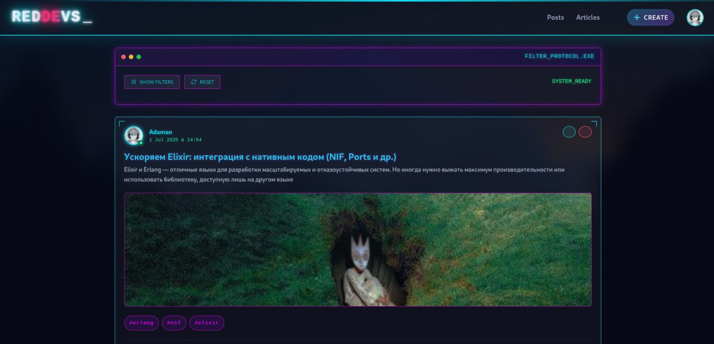

# 🚀 RedDevs — Портал для разработчиков

RedDevs — это современный портал для разработчиков, объединяющий статьи, посты, комментарии, лайки и систему уведомлений. Проект создан на базе Elixir и Phoenix Framework для быстрого, масштабируемого и удобного взаимодействия внутри IT-сообщества.





---

## ✨ Возможности

- 📚 Публикация и обсуждение статей и постов
- 💬 Комментарии и лайки к материалам
- 👥 Система пользователей и профилей
- 🔔 Уведомления о новых событиях
- 🔒 Аутентификация и восстановление пароля
- ⚡ Современный интерфейс и адаптивный дизайн

---

## 🚀 Быстрый старт

1. **Установите зависимости:**
   ```bash
   mix setup
   ```
2. **Запустите сервер:**
   ```bash
   mix phx.server
   ```
   или в интерактивном режиме:
   ```bash
   iex -S mix phx.server
   ```
3. **Откройте портал:**
   Перейдите в браузере по адресу [http://localhost:4000](http://localhost:4000)

---

## 🛠️ Технологии

- **Backend:** Elixir, Phoenix Framework
- **Frontend:** Phoenix LiveView, Tailwind CSS, DaisyUI
- **База данных:** PostgreSQL
- **Аутентификация:** Magic Link, Email Confirmation

---

## 📂 Структура проекта

- `lib/` — основной код приложения (контексты, ресурсы, веб-интерфейс)
- `assets/` — статические файлы и фронтенд
- `priv/repo/migrations/` — миграции базы данных
- `test/` — тесты

---

## 🤝 Вклад

Будем рады вашим pull request'ам и идеям!

---

## 📄 Лицензия

Проект распространяется под лицензией MIT.

---

RedDevs — вместе создаём лучшее IT-сообщество! 🚩

## Learn more

* Official website: https://www.phoenixframework.org/
* Guides: https://hexdocs.pm/phoenix/overview.html
* Docs: https://hexdocs.pm/phoenix
* Forum: https://elixirforum.com/c/phoenix-forum
* Source: https://github.com/phoenixframework/phoenix
